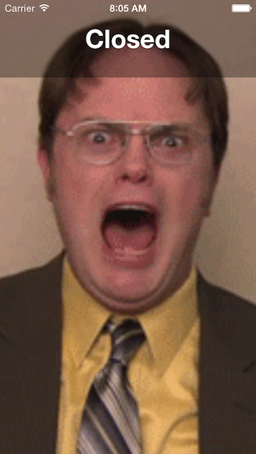

# Introduction to CocoaLumberjack

This is the demo code for the talk [Introduction to CocoaLumberjack](http://www.slideshare.net/ksmandersen/cocoa-lumberjack) at [Cocoaheads Copenhagen](http://www.meetup.com/CopenhagenCocoa/events/159203382/). The project is a simple app that checks the website of the student café at ITU called [Analog](http://cafeanalog.dk) and displays an animated GIF based on the open/closed status of the café.

